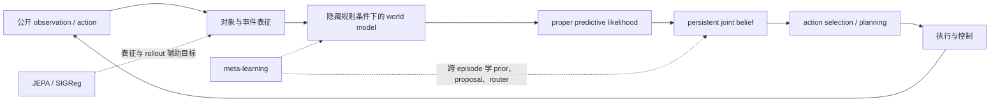
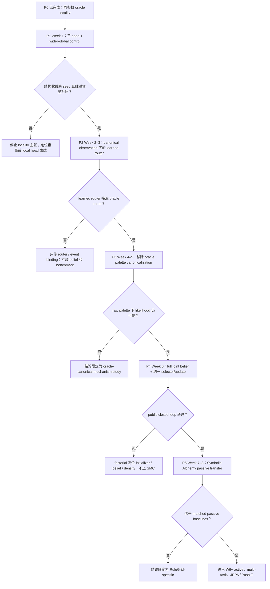
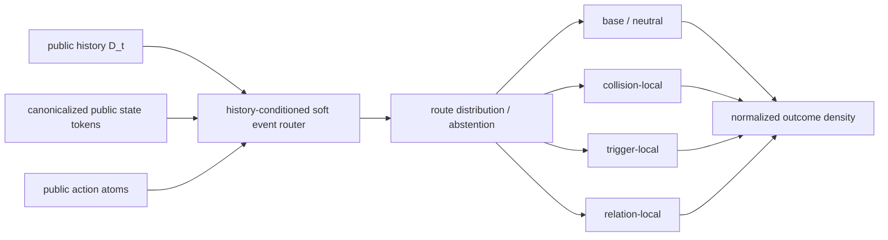
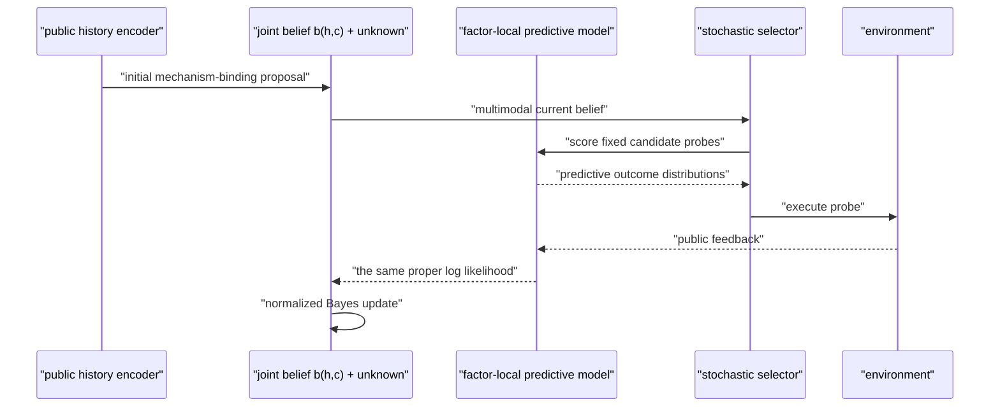
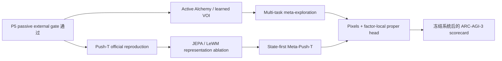
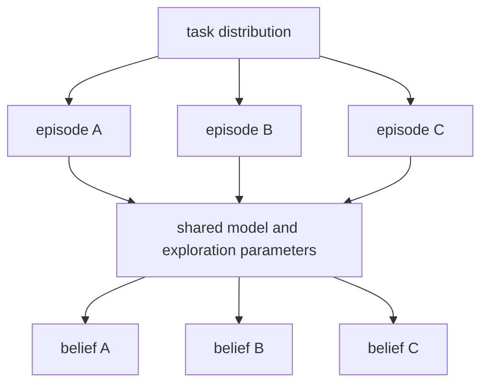

# PRP-WM 系统研究 Roadmap

日期：2026-07-24  
承诺周期：8 周、5 个串行 gate  
目标：从已验证的 oracle factor locality，推进到不依赖 oracle palette 的 public
belief system，并完成第一次团队外 passive meta-inference 验证。

当前执行状态：**P1 已完成并判定 NO-GO**。Factor-local 在 3/3 seeds
通过旧 belief gate，并把 RR P99 odds drop 降到约 `1e-6` nat，但 B2
固定为 `96.875%`，未达到 `98%` gate，也未优于 matched wider-global。
因此暂停 P2，先执行 P1.1 outcome-partition fidelity 修复。完整结果见
[`p1_matched_results_2026-07-24.md`](p1_matched_results_2026-07-24.md)。

## 1. 核心决策

未来八周只保留一个主命题：

> 面对 episode 内持续但未知的规则，public factor-local world model 与显式 joint
> belief，能否比单一 context、K1 和普通 ensemble 更可靠地适配未见机制？

八周内不把 learned active policy、multi-task exploration、JEPA、Push-T、MPC 和
ARC-AGI-3 同时接入主线。它们进入 conditional backlog，只有前置 gate 通过才启动。

这不是放弃完整 agent，而是把一个复杂系统拆成可证伪的接口。

## 2. 系统里其实有五个任务

实线是 episode 内 inference loop，虚线是训练时的外层能力。当前复杂度主要来自把这些
层同时优化，而不是 task 数量本身。

八周主线只做到 `O → R → W → L → B`，并用固定 probe family 做最小 action
selection 验证；通用动作生成和长时控制后置。

## 3. 已冻结的 P0 起点

状态：**完成**。

- Global executor：17,177 参数。
- 同参数 oracle-canonical factor-local executor：17,177 参数。
- 旧 active-prefix、single、pair、heldout-triple hard gates：100%。
- Forced cross-axis RR reversal：`0.5208% → 0%`。
- RR cross P99 log-odds drop：`18.352 → 0.0000038` nats。
- Two-axis learned/learned B2：`89.06% → 100%`。
- 代价：heldout singleton NLL/cell `0.3361 → 0.3574`。

所以已经排除最简单的“只因为参数太少”解释，但还没有排除：

1. 单一训练 seed/优化偶然；
2. oracle-canonical router privilege；
3. oracle palette canonicalization；
4. exact candidate restriction 与非统一 belief/planner。

冻结报告见
[factor-local executor validation](factor_local_executor_validation_2026-07-24.md)。

## 4. 八周只走五个串行 Gate

任何 no-go 都是可交付的研究结论，不自动触发“加宽模型、换 benchmark、加更多 loss”。

## 5. 时间表

| 阶段 | 时间 | 唯一主问题 | 结束交付 |
|---|---:|---|---|
| P1 | Week 1 | 收益来自 locality 还是容量/单 seed？ | 三臂三 seed matched report |
| P2 | Week 2–3 | learned public-event router 能否逼近 oracle route？ | router audit + closed-loop comparison |
| P3 | Week 4–5 | 去掉 palette canonicalization 后 likelihood 是否仍可信？ | raw-palette locality report |
| P4 | Week 6 | public initializer、joint belief、selector/update 能否统一？ | public two-axis closed loop |
| P5 | Week 7–8 | persistent belief 是否跨到外部 causal task？ | Symbolic Alchemy passive study |

每阶段开始时冻结 protocol；结束时只能做 go、no-go 或缩小 claim 三种决定。

## 6. P1：三 seed 与唯一 capacity control

### 主比较

历史 17,177 参数 global 与 oracle-local 只作参考。正式比较使用相同四分支拓扑：

| 条件 | factor-conditioning graph | 参数量 |
|---|---|---:|
| E1 Wider-global | base + 三个 axis branches；每支读取完整 factor tuple | 41,564 |
| E2 Factor-local | 相同 branch、router、mask；axis branch 只读自身 factor | 41,564 |

输出在 categorical probability 层组合，不能平均 change/color logits。

固定：

- seeds `2026072501, 2026072502, 2026072503`；
- 320 updates，不 early stop；
- 相同初始化、数据顺序、optimizer、teacher、router、mask 与 forward 次数；
- replay 与 random-geometry singleton/pair 配对；
- scenario/panel 为统计单位，不把 16 个 truths 或 frames 当独立样本。

### Go gate

- 3/3 seeds 的旧 active-prefix/single/pair/triple hard gate 为 100%；
- RR reversal `≤ 0.1%`，目标为 0；
- RR P99 odds drop `≤ 0.5` nat；
- B2 mean `≥ 98%`、worst seed `≥ 95%`；
- E2 在 paired cross-axis/B2 指标上优于参数与 compute matched E1；
- E2 heldout-triple NLL 相对 E1 劣化 `≤ 0.05` nat/cell。

若 E1 与 E2 同样好或 E1 更好，就否证“factorization 是主要变量”。

### 本阶段的图

1. 三个 seed 的 paired B2 slope chart；
2. cross-axis odds-drop ECDF，并标出 P99；
3. heldout NLL–locality Pareto 图；
4. `collision:v1` 等 worst subgroup 小图。

## 7. P2：canonical observation 下的 learned soft router

本阶段只替换 router；branch executor、known factor codebook、canonicalized state、
belief 和 probe family 全部冻结。

Router 不得读取：

- oracle axis、true factor、probe ID；
- split、seed、scenario index；
- 事后 feedback 或 target grid。

为了隔离问题，本阶段仍保留上游 palette canonicalization。也就是说，它回答的是
“能否从 transition/action event 学 route”，还没有回答 raw color role binding。

Router 输出 \(q_\phi(r\mid D_t,s_t,a_t)\) 并对 local predictions 做边缘化；不能先
argmax 成单帧 hard route。原因是部分早期 history 对 named mechanism 本来就不可辨识，
合理行为应是保留 route uncertainty 或 abstain。

### Go gate

- forbidden-input audit 全通过；
- action write-mask coverage 100%，互斥 event masks 不非法重叠；
- exact task factor-set rate `≥ 90%`；
- factor-set precision/recall `≥ 95%`，worst-axis `≥ 90%`；
- RR reversal `≤ 0.1%`、P99 drop `≤ 0.5` nat；
- worst-seed B2 `≥ 95%`；
- 与 oracle-router B2 差距 `≤ 3 pp`；
- 旧 hard gates 为 100%。

hard-route accuracy、macro-F1 和 raw NLL 的绝对阈值必须先由 symmetry-aware pilot
冻结，不能提前发明。即使分类指标很高，只要 posterior/B2 gate 失败，也只修 router
或 local density，不进入 P3。

### 本阶段的图

1. symmetry-aware router confusion / factor-set matrix；
2. scene/action 上的 route 与 write-mask overlay；
3. oracle vs learned router 的 posterior trajectory；
4. route/binding confidence 的 coverage-risk 与 likelihood calibration。

## 8. P3：移除 oracle palette canonicalization

本阶段只替换输入表征与 role binding；P2 router、belief bank、planner 和训练 protocol
冻结。

目标表征应对 color permutation 等变，并从关系、连通组件、动作位置和局部运动推断
actor、object、trigger 等角色，而不是把固定颜色当语义。P3 的 public proposal
应输出 \(q_\phi(r,c\mid D_t,s_t,a_t)\)，其中 \(c\) 是 palette binding 或公开
可辨识 equivalence class；world model 对 \(r,c\) 边缘化，而不是先选一个 binding。

### 对照

- oracle palette canonicalization ceiling；
- raw color embedding；
- color-permutation-equivariant object/event encoder；
- encoder + explicit role-binding uncertainty。

### Go gate

- test-time 路径完全不调用 privileged palette transform；
- heldout palette/geometry 下旧 gates `≥ 95%`，release target 为 100%；
- RR reversal `≤ 0.1%`、P99 drop `≤ 0.5` nat；
- B2 `≥ 90%`；
- target binding/mechanism equivalence-class probability mass `≥ 90%`；
- 对同一场景做任意合法 color renaming，posterior 与 action ranking 保持一致；
- oracle/raw 差距能被 role-binding uncertainty 解释，而不是静默给出过度自信 evidence。

若失败，保留 P0–P2 为机制研究，不声称已有 public agent。

### 本阶段的图

1. color-permutation consistency heatmap；
2. object-role assignment matrix；
3. raw vs canonical likelihood reliability diagram；
4. 按 palette/geometry/worst-role 分面的 B2。

## 9. P4：joint mechanism-binding belief 与统一 selector/update

### 删除旧耦合

- `[4]×[4]×[4]` marginals 的乘积只保留为 baseline/展示，不再是正式 belief；
- public network 只产生 initial prior/proposal，不直接伪装为 Bayesian posterior；
- selector 与 updater 必须调用同一个 \(p_\theta(y\mid s,a,h,c)\)；
- 去掉 exact 16-code initial restriction，维护
  \(b_t(h,c)\)，其中 \(h\) 是 mechanism、\(c\) 是 palette binding/equivalence
  class，并保留 `unknown/unproposed` probability mass。

在 canonical diagnostic 中，mechanism 只有 64 个 hypotheses；去掉 palette
canonicalization 后，仅维护 64 个 named mechanism codes 已不充分。P4 先对小规模
binding set 建 exhaustive/equivalence-class reference，再维护 proposal 返回的有限
joint table 与 unknown mass。此阶段不把 GRAM、SMC、adaptive-K 或连续 latent
particles加入主比较。

另建一个 correlation stress set：两种 posterior 具有完全相同 marginals，但 joint
correlation 不同且最优 probe 不同。exact joint reference 必须 100% 通过，否则原
Cartesian benchmark 无法真正检验 joint belief。

### 2×2 factorial

| Belief state | Update/selector | 目的 |
|---|---|---|
| exhaustive equivalence-class joint | shared stochastic model | world-model ceiling |
| learned proposal + product marginals | shared stochastic model | joint-belief 消融 |
| learned proposal + persistent joint | shared stochastic model | 目标系统 |
| persistent joint + shuffled history | shared stochastic model | online adaptation 负控制 |

### Go gate

- exact control 与 probability normalization 全通过；
- joint-to-marginal consistency 与 selector/updater shared-tensor 误差 `<1e-6`；
- exact correlation-stress reference 100% 通过；
- exhaustive internal split 不发生高置信度淘汰真 query；
- public learned/learned B2 `≥ 90%`，目标 `≥ 95%`；
- full joint 的 heldout posterior log score/Brier 不劣于 product baseline；
- 固定 probe bank 下 stochastic selector 相对 uniform 的 paired
  budget-success AUC 95% CI 下界 `> 0`。

正式 P4 使用 5 个未用于开发的 scenario seeds：`3 pairs × 16 groups × 5 = 240`
scenarios / `3,840` truth paths。K 的绝对值、ECE 与 Coverage@K 的绝对门槛需在
equivalence-class pilot 后冻结；不能默认 K4 对 raw binding 空间充分。

如果 learned prior 失败而 exact prior 通过，只修 proposal；如果两者都失败，只修
predictive density。不得直接上更大的 particle model。

### 本阶段的图

1. mechanism × binding joint posterior 的 conditional slices；
2. 每个 observation 后的 belief trajectory；
3. posterior reliability diagram；
4. exact-prior/learned-prior × product/joint 的 paired B2 图。

## 10. P5：Symbolic Alchemy passive transfer

第一次外部验证只测试 passive adaptation，不同时加入 active VOI。

### 主问题

> 在未见 chemistry/task composition 上，persistent multi-hypothesis belief
> 是否优于 matched recurrent context、K1 和 ordinary ensemble？

### 条件

- ideal/full-history ceiling；
- recurrent context；
- K1；
- ordinary ensemble；
- episode 内每步重新推断的 Reinfer-K4；
- persistent-K4/full-joint belief。

所有方法使用相同 observation/action prefixes、encoder budget 与 training data。

### Go gate

- passive trial-prefix adaptation AUC 或 paired return 相对最强 matched baseline
  的 hierarchical bootstrap 95% CI 下界 `> 0`；
- posterior log score、Brier、Coverage@K 不退化；
- 每个 training seed 与 worst chemistry group 单独报告；
- 3 development seeds 方向一致后，才打开 5 个未调参 confirmatory seeds。

固定 1,000 个 formal evaluation episodes，并以 episode 为统计单位；十个 trials
不能当十个独立样本。若尚未完成 chemistry equivalence-class scorer，不预注册
Coverage@K 的绝对门槛。

若失败，结论限定为 RuleGrid-specific；不立即改跑 Meta-Push-T 来替代问题。

### 本阶段的图

1. return/adaptation accuracy vs observed trials；
2. hypothesis coverage 与 calibration small multiples；
3. method × chemistry-family matrix；
4. persistent 与 reinfer belief 的 episode trajectory。

## 11. 八周以后才启动的 Conditional Backlog

后置项目包括：

- learned action generation、reachability、CEM/MPC、多步 recourse；
- multi-task exploration；
- JEPA/LeWM、Push-T、Meta-Push-T；
- GRAM/SMC、adaptive-K、continuous task latent；
- large-scale pixels model；
- ARC-AGI-3。

### Multi-task 的正确含义

不同 episode 共享 encoder、router、world model、proposal 和 exploration policy，但每个
episode 保持独立 belief。不能把多个任务的 belief 混成一个 hidden state，也不能提供
显式 task ID。

标准 vanilla Push-T 只测像素、接触动力学与规划，不足以支持 multi-task exploration
主张；只有包含多个 episode-level hidden physical regimes 的 Meta-Push-T 才进入该
问题。

## 12. 模型和数据何时扩

| 失败层 | 优先扩展 | 不应先做 |
|---|---|---|
| event router | event tokens、counterfactual route pairs | 增加 particles |
| raw role binding | equivariant encoder、palette diversity | 加 planner samples |
| within-axis NLL | local event head、counterfactual dynamics data | 扩 global decoder |
| proposal coverage | task diversity、K=1/4/8 消融 | 加动作 horizon |
| belief 已准但选择失败 | stochastic VOI、action generator | 重训所有模块 |
| pixels rollout 失败 | JEPA/encoder capacity、visual data | 修改 symbolic belief |

数据优先级：

1. 独立 hidden-dynamics combinations；
2. 相同 state/action 的 counterfactual pairs；
3. exploratory 与 expert trajectories 的覆盖混合；
4. visual nuisance 与 dynamics 正交的数据；
5. 最后才是更多同分布 frames。

## 13. 每个阶段固定的绘图与证据规范

每个 phase 的报告必须同时包含：

- 一张 architecture/data-flow diff，标出本阶段唯一改变；
- 主指标的 paired per-seed 图；
- posterior 或 likelihood 的过程图；
- worst subgroup 图；
- gate 的 pass/fail 图示。

统计单位必须是 episode/scenario/task，不能把 frames 或同一 scenario 的 truth codes
当独立样本。主图显示每个 seed、paired 置信区间和 worst subgroup，不能只给 aggregate
柱状图。

## 14. 系统优化纪律

1. 每阶段只有一个主问题、一个主比较、一个 go/no-go gate。
2. 前一阶段冻结后才能进入下一阶段。
3. 失败后不能同时更换模型、数据和 benchmark。
4. oracle 只作 ceiling/故障定位，不进入 public condition。
5. development 使用 3 seeds；正式结论使用 5 个未参与调参的 seeds。
6. 每阶段最多 12 个 validation tuning runs；formal test manifest 只打开一次。
7. hierarchical paired bootstrap 使用 10,000 resamples。
8. 保存 source SHA、data manifest、checkpoint lineage、命令、plots 和 worst cases。
9. 不继续建立 hand-crafted belief head zoo。
10. product marginals 和 MAP-grid planner 只保留为消融。
11. 八周内只允许一次 wider-global capacity control，不继续 teacher/width sweep。
12. 不把异质 benchmark 分数平均成一个“总 AGI 分数”。

## 15. 八周后的允许结论

只接受以下五种：

1. **进入 active/meta/pixels：** 五个 gate 全通过；
2. **保留 public RuleGrid claim：** raw public loop 通过，Alchemy passive 无增益；
3. **保留 oracle-canonical mechanism claim：** P1/P2 通过，raw palette P3 失败；
4. **支持容量而非结构：** matched wider-global 与 factor-local 同样好或更好；
5. **停止主路线：** public locality 与 persistent belief 在 matched controls 下均无
   稳定增益。

不允许的第六种结论是：“结果还不够好，因此无条件再加参数、数据和 benchmark。”
